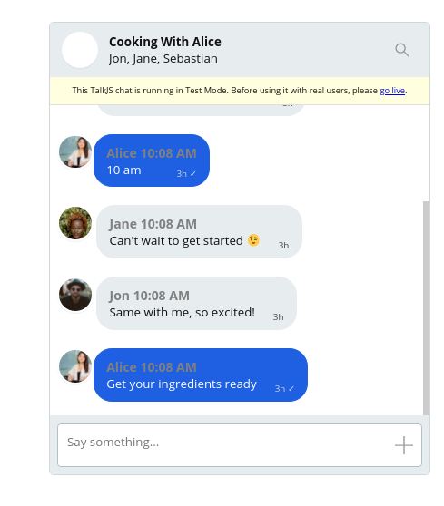
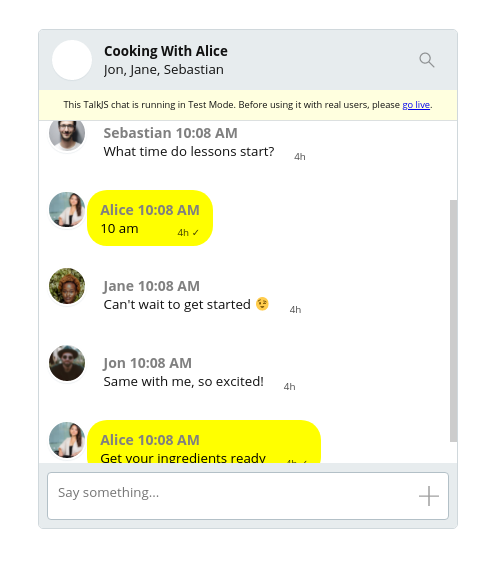
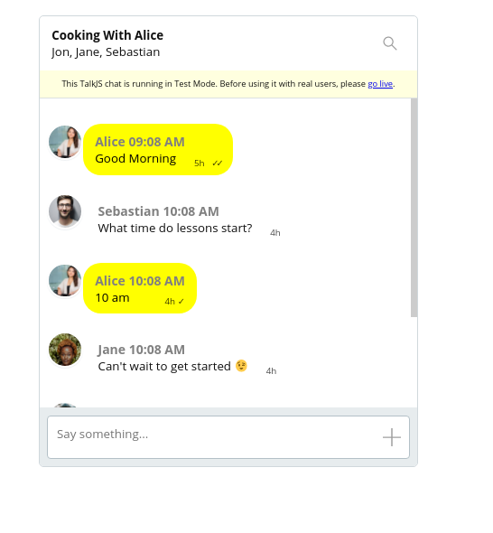

## How to Create a Chatroom with Multiple Users Using TalkJS (Inspired by Youtube live)

One of the many use cases of TalkJS is in education. TalkJS allows you to quickly embed chat and chat rooms in your elearning platform.

Let us imagine you are running an online class on cooking, where you deliver lessons via video, like Youtube. You might need a real time chat that allows your students to discuss as they follow along. In this tutorial we'll show how to build a group chat feature inspired by Youtube Live using the TalkJS API and The Theme Editor.

Let's get started.

### Setting Up Our Project

We need to do the following:

1. Create a group conversation
2. Create role(s)
3. Create and customize our theme for the role(s)

### Creating a group conversation

First we'll create a group conversation with multiple users. This is covered in the [Group Chats docs](https://talkjs.com/docs/Features/Group_Chats/). Remember to use your TalkJS appId, this is found in the dashboard. You may want to add the `photoUrl` property to each user so they get an avatar. Free images can be found on places like [pexels](https://pexels.com), [unsplash](https://unsplash.com) etc.

We can specify a `subject` using `session.setAttributes`. We then use the chatbox UI mode to render our chat:

```
Talk.ready.then(function() {
    ...
    conversation.setAttributes({
        subject: "Cooking With Alice"
    });
    var chatbox = talkSession.createChatbox(conversation);
    chatbox.mount(document.getElementById("talkjs-container"));
})
```

Our chat will look like this:


### Creating Roles

Now we need to create roles for our users in the [dashboard](https://talkjs.com/dashboard). In the header of the dashboard, click on **Roles** and add a new role. You can name this however you wish, for example "youtube"/


We then need to add the `role` property to our users, and specify it to be our newly created role, in our case `youtube`.

```
var me = new Talk.User({
    id: "123456",
    name: "Alice",
    email: "alice@example.com",
    photoUrl: "/path_to_photo",
    role: "youtube"
});

....

var user1 = new Talk.User({
    id: "234567",
    name: "Alice",
    email: "alice@example.com",
    photoUrl: "",
    role: "youtube"
});

```

## Activating a theme

The theme that is used to display a TalkJS UI depends on the current user's role. If no role is set, the default theme is used.

To configure a theme for a role, go to dashboard, and click Roles, then create or select a role and scroll down to the "UI Theme" section.


### Customizing our Theme

Now that we have our role all set up, we can customise our layout to look better using the Theme Editor. We'll draw some inspiration from Youtube Live's chat feature.


### Things To Do
- Have all messages on the left side and to show a timestamp
- Remove the backgrounds on chat bubbles
- Make admin/instructor's message to be prominent

Most of the edits will be done in the `UserMessage` part of the Theme Editor.

#### The `UserMessage` Component

In the Theme Editor, we navigate to the `UserMessage` component, this is where most of the code for our UI lives.

We want all our messages to be on the left side and to show a time stamp.

Replace lines 67 -71:

```
<div t:if="{{ sender.isMe == false and conversation.others.length > 1 }}"
    class="message-author"
    style="color: {{ sender.id | random_color }}">
    {{ sender.name }}
</div>

```
with:

```
<div t:if="{{ conversation.others.length > 0 }}" class="message-author"
    style="color: gray; font-size: 14px">
   {{ sender.name }} <span class = "time-sent"> {{ timestamp |  date: "%H:%m %p"}}</span>
</div>

```
The code above changes the color of author names from random to gray.

To have all messages appear on the left side of the chatbox we need to find the `.message-row.by-me` class and delete it or remove the `flex-direction` property.

Our chat will look like this:

.

We have made some progress, but we still need to remove the chat bubbles backgrounds and also clean up the header.

Still in the `UserMessage` component, we find the class `.by-me.message` and delete `border-color` and `background-color` properties. This will make the chat backgrounds uniform. Also change the `color` property to match the default text, in this case black.

We need to remove the chat bubble styling, and to do that we go into the `message` class and make a couple of edits. We delete `background-color`, `border-style` and `border-radius` and `border-width` leaving the `.message` class like this:

```
.message {
    white-space: normal;
    overflow: hidden;
    border-radius: 1.5rem;
    word-wrap: break-word;
    position: relative;
    display: inline-block;
    max-width: calc(100% - 6rem - 0.25rem - 0.25rem);
    border-color: #E7ECEE;
    color: #111;
}
```

On Youtube live the host's username has a yellow background, making their messages more visible. So we can add new property `background-color: yellow`, under the `.by-me.message` class to have the messages you send show as yellow. 




We are almost done, all that's left is to change the header color to white and get rid of the avatar

### The `ChatHeader` Component

The ChatHeader component contains the UI code for the chatbox or inbox header. We can delete the following lines 38-40, to get rid of the avatar :

```
<div class="image">
    <ConversationImage conversation="{{conversation }}" />
</div>

```
We then scroll down to the `.header` class and and change the background-color to #FFF and add then give it a `border-bottom` of `1px solid #FAFAFA`. This gives the header a faint gray bottom border.

## Wrapping Up

Our chat UI now looks like this:



So there we have it, our final chatroom inspired somewhat by Youtube built using TalkJS API. 

You can further customise it, including adding [unread message counters](), changing fonts, [defining user permissions]() and more, all while using the Theme Editor and the TalkJS API. TalkJS is extremely flexible and allows you to build many different kinds of layouts in a short time.